# Application Architecture

## Overview

This is a **React 18 + TypeScript** enterprise application featuring:
- Redux Toolkit for state management
- React Router v6 for navigation
- Wijmo for advanced data grids
- Tailwind CSS for styling
- Multi-tab interface with persistence
- Dynamic form execution engine

---

## 1. High-Level Architecture

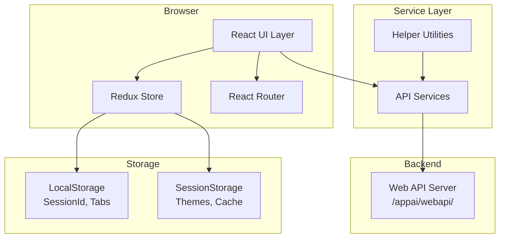

---

## 2. Application Entry Flow

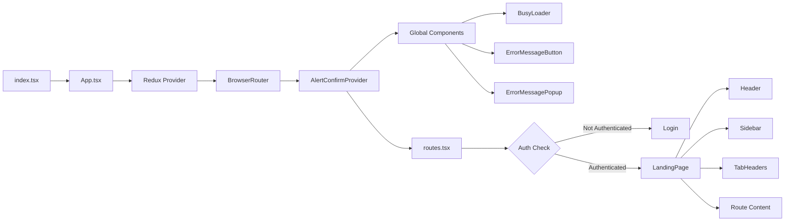

---

## 3. Redux Store Structure

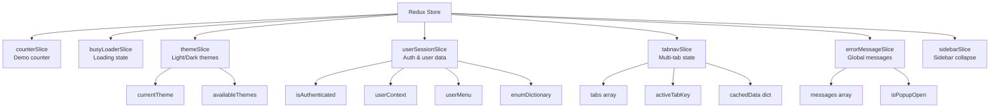

---

## 4. Authentication Flow

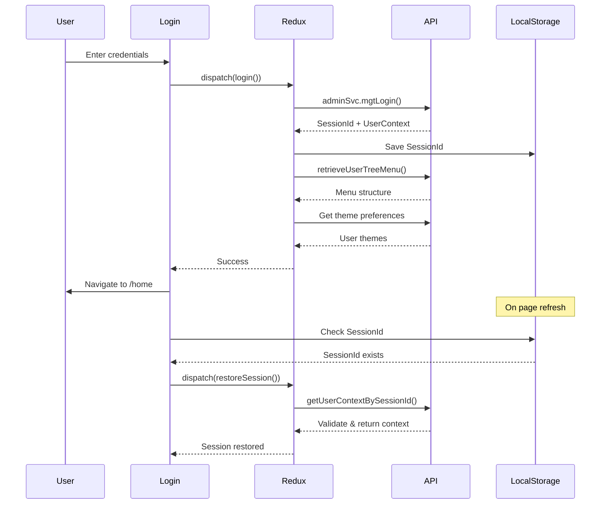

---

## 5. Component Architecture

```mermaid
graph TB
    subgraph "Main Layout"
        LP[LandingPage]
        LP --> Header
        LP --> Sidebar
        LP --> TabHeaders
        LP --> Outlet[Route Outlet]
    end

    subgraph "Admin Features"
        Outlet --> Login
        Outlet --> MyApps[MyApplications]
        Outlet --> UserMgmt[UserManagement]
        Outlet --> AppEditor[MyApplicationEditor]
        Outlet --> ThemeMgmt[ThemeManagement]
        Outlet --> DataSource[DataSourceRegister]
    end

    subgraph "Search Module"
        Outlet --> Search[AppSearch]
        Search --> Filter[SearchFilter]
        Search --> View[SearchView]
        View --> Grid[GridViewLayout]
        View --> Calendar[CalendarViewLayout]
        View --> Gantt[GanttViewLayout]
        View --> Pivot[PivotViewLayout]
    end

    subgraph "Form Module"
        Outlet --> Form[FormMasterDetail]
        Form --> EditLayout[MasterDetailEditLayoutForm]
        EditLayout --> Controls[Form Controls]
        Controls --> TB[TextBoxControl]
        Controls --> DDL[DDLControl]
        Controls --> Date[DateControl]
        Controls --> Num[NumericControl]
        Controls --> CB[CheckBoxControl]
        Controls --> Memo[MemoControl]
        EditLayout --> DataGrid[DataGridLayout]
    end

    subgraph "Form Builder"
        Outlet --> Builder[ApplicationFormBuilder]
        Builder --> Designer[FormDesign]
        Builder --> GraphicEditor[TransactionGraphicEditor]
        Builder --> UnitEditor[UnitStructureEditor]
    end

    subgraph "Common Components"
        Outlet --> Common[Shared Components]
        Common --> BusyLoader
        Common --> ErrorPopup[ErrorMessagePopup]
        Common --> ErrorBtn[ErrorMessageButton]
        Common --> Confirm
        Common --> Alert
    end
```

---

## 6. Multi-Tab Navigation System

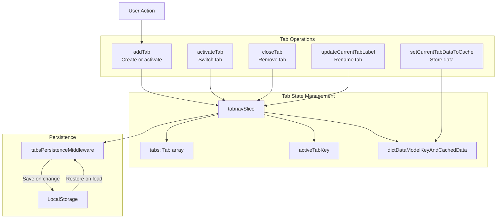

---

## 7. API Service Layer

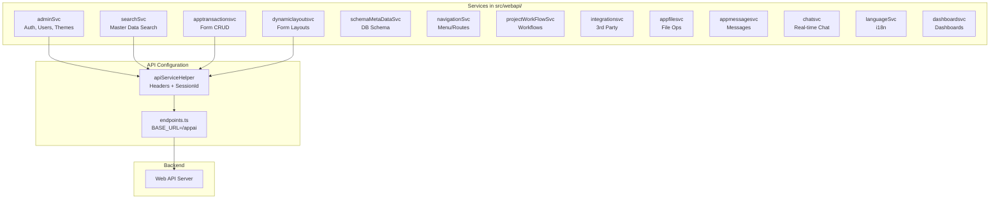

---

## 8. Theming System

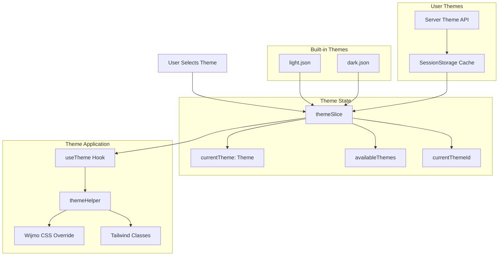

---

## 9. Data Flow: Opening a Search

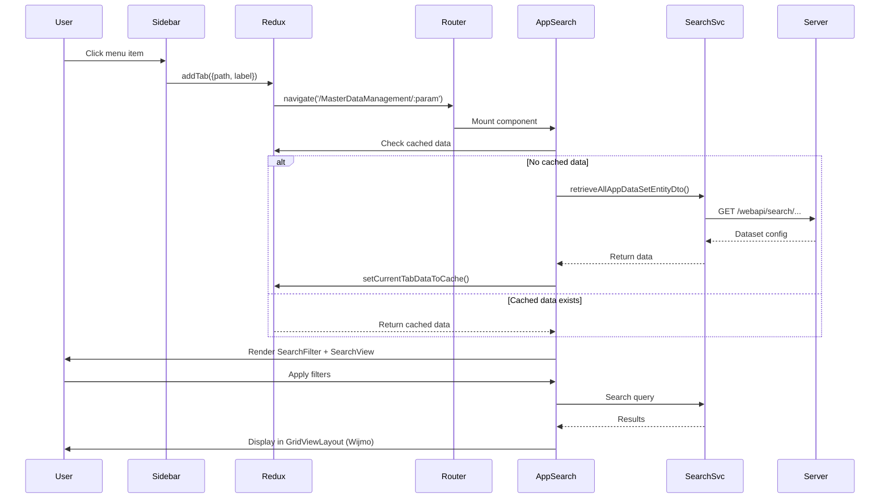

---

## 10. Data Flow: Form Execution

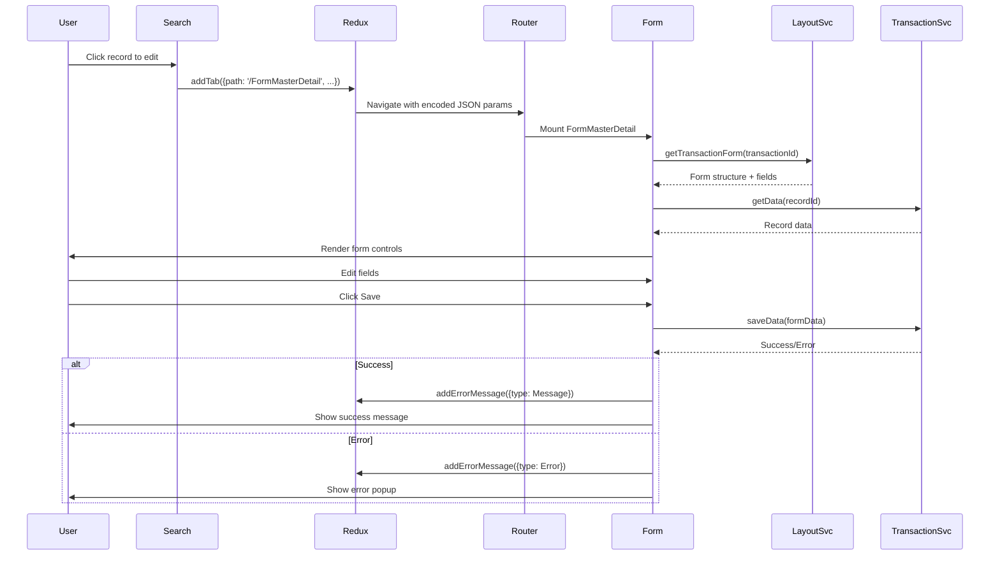

---

## 11. Error Handling System

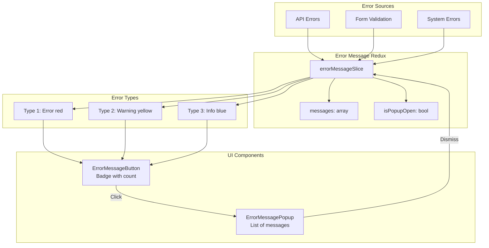

---

## 12. Key Technology Stack

| Layer | Technology | Version | Purpose |
|-------|-----------|---------|---------|
| **UI Framework** | React | 18.3.1 | Component-based UI |
| **Language** | TypeScript | 4.9.5 | Type safety |
| **State Management** | Redux Toolkit | 2.8.2 | Global state |
| **Routing** | React Router | 6.28.0 | Navigation |
| **Styling** | Tailwind CSS | 3.4.17 | Utility-first CSS |
| **Data Grids** | Wijmo | 5.20252.42 | Enterprise grids |
| **Real-time** | SignalR | 8.0.7 | WebSocket communication |
| **Build Tool** | React Scripts | 5.0.1 | CRA build system |
| **Testing** | Jest + React Testing | Built-in | Unit testing |

---

## 13. File Structure

```
app-react/
├── public/                      # Static assets
├── src/
│   ├── index.tsx                # Application entry point
│   ├── App.tsx                  # Root component with providers
│   ├── routes.tsx               # Route definitions + auth guard
│   │
│   ├── components/              # React components
│   │   ├── admin/               # Admin features (Login, Users, etc.)
│   │   ├── mainLayout/          # Layout components (Header, Sidebar, Tabs)
│   │   ├── formMgt/             # Dynamic form execution
│   │   ├── search/              # Master data search
│   │   ├── transaction/         # Form builder
│   │   └── common/              # Shared UI components
│   │
│   ├── redux/
│   │   ├── store.ts             # Redux store configuration
│   │   ├── rootReducer.ts       # Combined reducers
│   │   ├── hooks/               # Custom Redux hooks
│   │   └── features/            # Redux slices by feature
│   │       ├── admin/           # userSessionSlice
│   │       └── ui/              # UI-related slices
│   │           ├── theme/       # themeSlice
│   │           ├── navigation/  # tabnavSlice, sidebarSlice
│   │           └── feedback/    # errorMessageSlice, busyLoaderSlice
│   │
│   ├── webapi/                  # API service classes
│   │   ├── endpoints.ts         # API base URL config
│   │   ├── adminsvc.ts          # Authentication & admin APIs
│   │   ├── searchSvc.ts         # Search APIs
│   │   ├── apptransactionsvc.ts # Form transaction APIs
│   │   └── ...                  # Other service modules
│   │
│   ├── helper/                  # Utility functions
│   │   ├── apiServiceHelper.ts  # API headers with SessionId
│   │   ├── themeHelper.ts       # Theme utilities
│   │   ├── navigationHelper.ts  # URL building
│   │   └── ...
│   │
│   ├── types/                   # TypeScript type definitions
│   ├── styles/                  # CSS and theme files
│   │   └── theme/               # Theme JSON files (light.json, dark.json)
│   └── setupTests.ts            # Test configuration
│
├── package.json                 # Dependencies
├── tsconfig.json                # TypeScript config
├── tailwind.config.js           # Tailwind configuration
└── CLAUDE.md                    # Development instructions
```

---

## 14. Key Patterns & Best Practices

### State Management Pattern
- **Local state** for UI-only concerns (modals, form inputs)
- **Redux** for:
  - Authentication & user session
  - Global UI state (theme, sidebar, busy loader)
  - Multi-tab navigation with caching
  - Error message queue

### Data Fetching Pattern
```typescript
// In component:
useEffect(() => {
  const fetchData = async () => {
    dispatch(setIsBusy(true));
    try {
      const data = await myService.getData();
      setLocalState(data);
    } catch (error) {
      dispatch(addErrorMessage({message: error.message, type: MessageType.Error}));
    } finally {
      dispatch(setIsNotBusy(false));
    }
  };
  fetchData();
}, [dependencies]);
```

### Custom Hooks Pattern
- `useTabNavigation()` - Tab operations + routing
- `useTheme()` - Theme access + CSS class helpers
- `useErrorMessage()` - Error/warning/info messages
- `useAppDispatch()` / `useAppSelector()` - Typed Redux hooks

### Persistence Pattern
- **localStorage**: SessionId, tab state
- **sessionStorage**: Theme cache, user preferences
- **Redux middleware**: Automatic persistence on state changes

### Route Protection Pattern
```typescript
// In routes.tsx:
{!userContext.IsLoginFailed ? (
  <Route path="/protected" element={<ProtectedComponent />} />
) : (
  <Route path="*" element={<Navigate to="/login" />} />
)}
```

---

## 15. Performance Optimizations

1. **Lazy Loading**: Routes loaded on-demand with `React.lazy()`
2. **Data Caching**: Per-tab data cache in Redux prevents refetching
3. **Persistence**: Tabs and session persisted to avoid reload costs
4. **Middleware**: Custom middleware for selective persistence
5. **Memoization**: Components can use `useMemo` / `useCallback` for expensive operations

---

## 16. Security Considerations

1. **SessionId Authentication**: All API calls include SessionId in headers
2. **Route Guards**: Unauthenticated users redirected to login
3. **Session Validation**: SessionId validated on page refresh
4. **LocalStorage**: SessionId stored (consider HttpOnly cookies for production)
5. **Error Handling**: Sensitive errors not exposed to UI

---

## 17. Future Enhancement Opportunities

1. **Type Safety**: Replace `any` types with proper interfaces
2. **Error Boundaries**: Add React error boundaries for graceful failures
3. **Code Splitting**: Further split large components
4. **Testing**: Expand test coverage beyond basic setup
5. **SignalR**: Implement real-time features using existing infrastructure
6. **Performance**: Add React.memo to frequently re-rendering components
7. **Security**: Move from localStorage to HttpOnly cookies
8. **i18n**: Leverage languageSvc for full internationalization

---

This architecture provides a solid foundation for an enterprise React application with advanced features like multi-tab navigation, dynamic forms, and a sophisticated theming system integrated with professional data grid components.
