# POM / Grading / QC — ER Diagram

Schema source: `POM_Grading_QC_NewSchema.sql`

```mermaid
erDiagram
    %% ── FOUNDATION ────────────────────────────────────────────
    TchpSizeRun {
        int SizeRunId PK
        nvarchar SizeRunCode
        nvarchar SizeRunName
        bit IsActive
    }
    TchpSizeRunSize {
        int SizeRunSizeId PK
        int SizeRunId FK
        nvarchar SizeLabel
        int SizeOrder
        bit IsActive
    }
    TchpBodyPart {
        int BodyPartId PK
        nvarchar Code
        nvarchar BodyPartName
        decimal Tolerance
        decimal GradingPlusValue
        decimal GradingMinuValue
        bit IsActive
    }
    TchpPomTemplate {
        int PomTemplateId PK
        nvarchar TemplateCode
        nvarchar TemplateName
        int DefaultBaseSizeId FK
        bit IsActive
    }
    TchpPomTemplatePart {
        int PomTemplatePartId PK
        int PomTemplateId FK
        int BodyPartId FK
        nvarchar BodypartAliasName
        int Sort
    }
    TchpSizeRunDimension {
        int SizeRunDimensionId PK
        int SizeRunId FK
        int SizeRunSizeId FK "UQ - one size, one dim"
        nvarchar DimensionCode
        int SortOrder
    }
    TchpSizeSystemMapping {
        int SizeSystemMappingId PK
        int SizeRunSizeId FK
        nvarchar SystemCode "US|EU|UK|JP|CN|INTL"
        nvarchar SizeLabel
    }

    %% ── GRADE RULE LIBRARY ───────────────────────────────────
    TchpGradeRuleSet {
        int GradeRuleSetId PK
        nvarchar GradeRuleSetName
        nvarchar Standard "ASTM|ISO|CUSTOM"
        nvarchar Description
        bit IsActive
    }
    TchpGradeRule {
        int GradeRuleId PK
        int GradeRuleSetId FK
        nvarchar BodyPartCode "loose-no FK to TchpBodyPart"
        decimal GradingPlusValue
        decimal GradingMinuValue
        bit IsSymmetric
        smallint Sort
    }

    %% ── STYLE SPEC ───────────────────────────────────────────
    TchpStyleSpec {
        int StyleSpecId PK
        int ProductReferenceId "external product ref"
        int SizeRunId FK
        int BaseSizeDetailId FK
        nvarchar UnitOfMeasure "CM|INCH"
        nvarchar SpecStatus "DRAFT|APPROVED|LOCKED"
        int Version
        nvarchar DiffDisplayMode "DELTA|PERCENT"
    }
    TchpStyleSpecDimension {
        int StyleSpecDimensionId PK
        int StyleSpecId FK
        nvarchar DimensionCode "loose-no FK to SizeRunDimension"
        bit IsActive "1=current grading pivot"
        int SortOrder
    }
    TchpPomSpecLine {
        int PomSpecLineId PK
        int StyleSpecId FK
        int BodyPartId FK
        int GradeRuleSetId FK "nullable"
        decimal BaseValue
        decimal Tolerance
        bit IsFixed "1=no grading"
        int Sort
        nvarchar BodypartAliasName
    }
    TchpGradeValue {
        int GradeValueId PK
        int PomSpecLineId FK
        int SizeRunSizeId FK
        decimal GradingDelta "0 at base size"
    }

    %% ── FIT ITERATION ────────────────────────────────────────
    TchpFitRound {
        int FitRoundId PK
        int StyleSpecId FK
        smallint RoundNumber
        nvarchar RoundType "PP1|PP2|PP3|TOP|INTERNAL"
        nvarchar RoundStatus "PENDING|SUBMITTED|APPROVED|REJECTED"
        datetime SubmittedAt
        int SubmittedById
        datetime ApprovedAt
        int ApprovedById
        nvarchar RejectionReason
    }
    TchpFitMeasurement {
        int FitMeasurementId PK
        int FitRoundId FK
        int PomSpecLineId FK
        decimal ActualValue "null = not yet measured"
    }

    %% ── QC ───────────────────────────────────────────────────
    TchpQcOrder {
        int QcOrderId PK
        int ProductReferenceId "external product ref"
        int StyleSpecId FK
        nvarchar LotNumber
        int FactoryId "external vendor ref"
        nvarchar AqlLevel "CRITICAL_1|MAJOR_2_5|MINOR_4_0"
        int LotQuantity
        int SampleSize "computed by AqlSamplingService"
        nvarchar OrderStatus "OPEN|IN_PROGRESS|PASSED|FAILED"
    }
    TchpQcOrderSize {
        int QcOrderSizeId PK
        int QcOrderId FK
        int SizeRunSizeId FK
    }
    TchpQcGarment {
        int QcGarmentId PK
        int QcOrderId FK
        nvarchar GarmentSerial
        bit GarmentPassStatus "null=not evaluated"
    }
    TchpQcResult {
        int QcResultId PK
        int QcGarmentId FK
        int PomSpecLineId FK
        int SizeRunSizeId FK
        decimal ProductionValue "stage 1"
        decimal BeforeWashValue "stage 2"
        decimal AfterWashValue "stage 3"
        decimal AfterIronValue "stage 4"
        decimal SpecValue "snapshot from locked spec"
        decimal Tolerance "snapshot from locked spec"
        decimal Shrinkage "PERSISTED: Before-After"
        decimal Recovery "PERSISTED: Iron-After"
        decimal FinalDiff "PERSISTED: Iron-Spec"
        bit Pass
        nvarchar DefectClass "CRITICAL|MAJOR|MINOR"
    }

    %% ── RELATIONSHIPS ─────────────────────────────────────────
    TchpSizeRun ||--o{ TchpSizeRunSize : "contains sizes"
    TchpSizeRun ||--o{ TchpSizeRunDimension : "dimension groups"
    TchpSizeRunSize ||--o| TchpSizeRunDimension : "assigned to one dimension"
    TchpSizeRunSize ||--o{ TchpSizeSystemMapping : "regional equivalents"
    TchpSizeRunSize }o--o| TchpPomTemplate : "default base size"

    TchpPomTemplate ||--o{ TchpPomTemplatePart : "contains body parts"
    TchpBodyPart ||--o{ TchpPomTemplatePart : "used in templates"

    TchpGradeRuleSet ||--o{ TchpGradeRule : "defines rules"

    TchpSizeRun ||--o{ TchpStyleSpec : "size run"
    TchpSizeRunSize ||--o{ TchpStyleSpec : "base size"
    TchpStyleSpec ||--o{ TchpStyleSpecDimension : "active dimensions"
    TchpStyleSpec ||--o{ TchpPomSpecLine : "POM lines"
    TchpBodyPart ||--o{ TchpPomSpecLine : "measured part"
    TchpGradeRuleSet ||--o{ TchpPomSpecLine : "rule set (optional)"
    TchpPomSpecLine ||--o{ TchpGradeValue : "graded per size"
    TchpSizeRunSize ||--o{ TchpGradeValue : "size column"

    TchpStyleSpec ||--o{ TchpFitRound : "fit iterations"
    TchpFitRound ||--o{ TchpFitMeasurement : "actual measurements"
    TchpPomSpecLine ||--o{ TchpFitMeasurement : "POM line measured"

    TchpStyleSpec ||--o{ TchpQcOrder : "inspected per order"
    TchpQcOrder ||--o{ TchpQcOrderSize : "selected sizes"
    TchpSizeRunSize ||--o{ TchpQcOrderSize : "size"
    TchpQcOrder ||--o{ TchpQcGarment : "sampled garments"
    TchpQcGarment ||--o{ TchpQcResult : "measurement results"
    TchpPomSpecLine ||--o{ TchpQcResult : "POM measured"
    TchpSizeRunSize ||--o{ TchpQcResult : "size measured"
```

## Table Groups

| Domain | Tables |
|---|---|
| **Foundation** | TchpSizeRun, TchpSizeRunSize, TchpBodyPart, TchpPomTemplate, TchpPomTemplatePart, TchpSizeRunDimension, TchpSizeSystemMapping |
| **Grade Library** | TchpGradeRuleSet, TchpGradeRule |
| **Style Spec** | TchpStyleSpec, TchpStyleSpecDimension, TchpPomSpecLine, TchpGradeValue |
| **Fit Iteration** | TchpFitRound, TchpFitMeasurement |
| **QC Pipeline** | TchpQcOrder, TchpQcOrderSize, TchpQcGarment, TchpQcResult |

## Loose Couplings (no FK in DB)

| Column | Matches | Reason |
|---|---|---|
| `TchpGradeRule.BodyPartCode` | `TchpBodyPart.Code` | Rule sets are template-agnostic; applied by code string match |
| `TchpStyleSpecDimension.DimensionCode` | `TchpSizeRunDimension.DimensionCode` | Spec can reference a dimension before size-run mapping is complete |
